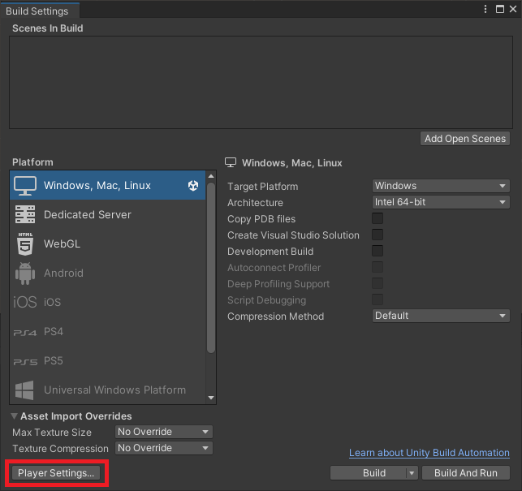
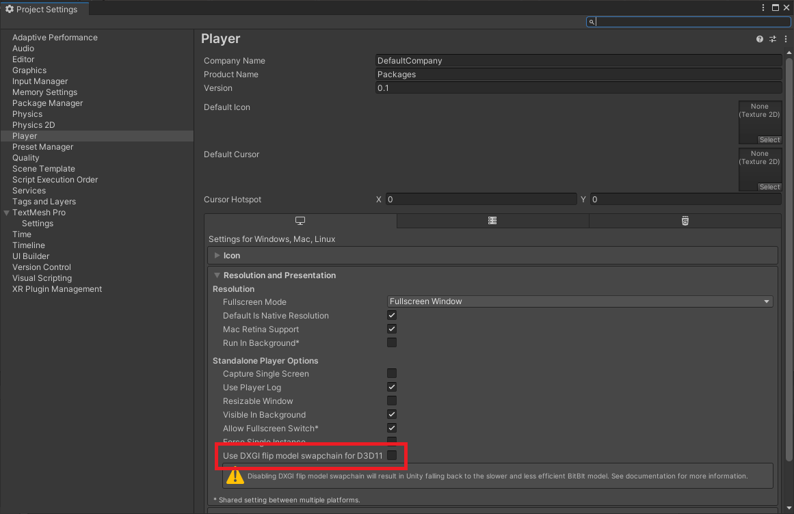
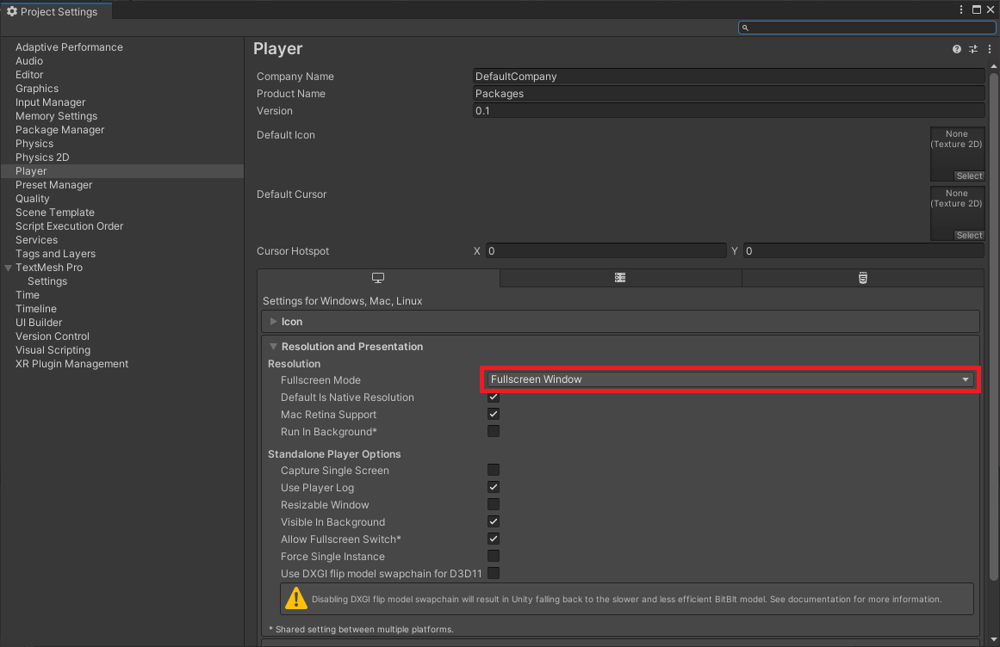
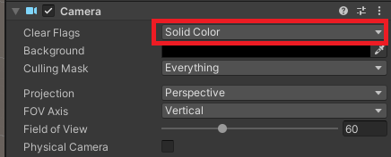
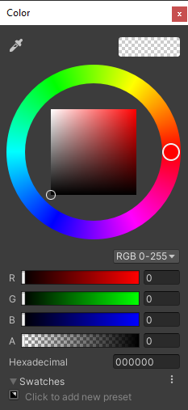

# Transparent Window
Turn your game background transparent

## How to use
Press ctrl+shift+b to open build settings or Open at menu
Click on "Player Settings..." button

Disable "Use DXGI flip model swapchain for D3D11"

Ensure Fullscreen Mode is "Fullscreen window"

Change camera Clear Flags to Solid Color

Also set background as black with aplha 0

